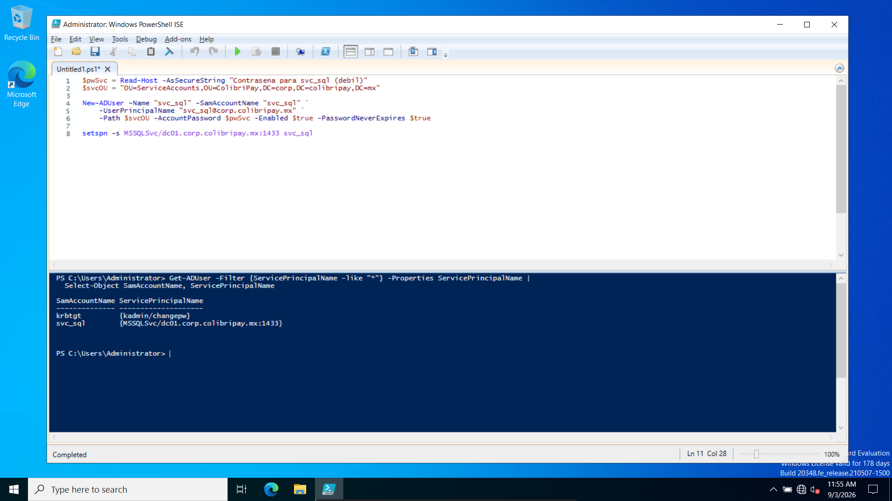
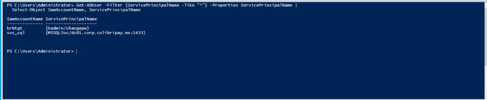

# Arquitectura


## Semana 1

### Componentes desplegados

| Atributo            | Valor                                                     |
|---------------------|-----------------------------------------------------------|
| OS                  | Windows Server 2022 Standard (Desktop Experience), eval   |
| Roles               | AD DS + DNS                                               |
| Hipervisor          | VirtualBox (host Windows Home, 16 GB RAM)                 |
| RAM / vCPU / Disco  | 4 GB / 2 / 60 GB                                          |
| FQDN                | `DC01.corp.colibripay.mx`                                 |
| Roles FSMO          | Todos                                                     |

### Direccionamiento

Red NAT de VirtualBox: `10.0.2.0/24`

| Host          | IP           |
|---------------|--------------|
| Gateway (NAT) | `10.0.2.1`   | 
| DC01          | `10.0.2.10`  | 
| WKS01         | `10.0.2.20`  |        
| Wazuh         | `10.0.2.30`  | 


### Dominio

| Atributo                        | Valor                 |
|---------------------------------|-----------------------|
| Dominio                         | `corp.colibripay.mx`  |
| NetBIOS                         | `CORP`                |
| Nivel funcional bosque/dominio  | Windows Server 2016   |

### Pasos

1. Creamos nuestro VM de Windows Server 2022

2. Entramos a las propiedades de IPv4 de nuestro servidor

3. Verificamos que nuestras opciones se guardaron correctamente:

4. En la ventana de Server Manager, nos vamos al menuú de "**Manage**" y hacemos *click* en "**Add Roles and Features**"

5. En la pestaña de "**Installation Type**", seleccionamos la [**Role Based or feture Installation**]

6. En la pestaña de  "**Sever selection**" seleccionamos el servidor por *default*
7. En la pestaña de "**Server Roles**" *palomeamos* **Active Directory DOmain Services y **aceptamos** el popup y **aceptamos** los *features*
8. Damos **siguiente** hasta confirmar e instalar

9. Configuramos el Domain Controller **Agregamos un** *new forest* con el *Root domain name* de **corp.colibripay.mx**
10. Terminamos de condigurar el Domain Controller con DNS y reiniciamos.


11. Verificamos la integridad en el cmd


# Estructura de identidad (OUs, usuarios y cuenta de servicio)

Todo el aprovisionamiento se hizo con **PowerShell** (reproducible y versionable), no por GUI.

**Diseño de OUs:**

```text
corp.colibripay.mx
└── OU=ColibriPay              ← OU raíz propia (todo lo administrado vive aquí)
    ├── OU=Usuarios
    │   ├── OU=IT
    │   ├── OU=Finanzas
    │   └── OU=Soporte
    ├── OU=Grupos
    ├── OU=ServiceAccounts     ← cuentas de servicio, aisladas
    └── OU=Equipos             ← destino de WKS01 (planeado)
```

Se usa una OU raíz propia (`ColibriPay`) en vez de trabajar sobre el dominio, para
poder aplicar GPOs por alcance sin afectar los Domain Controllers ni la
infraestructura del sistema. La OU `ServiceAccounts` se aísla porque las cuentas de
servicio son blanco de alto valor.

12. Creamos la estructura de OUs con PowerShell.


13. Creamos 7 usuarios distribuidos en sus OU de departamento (convención de login:
    inicial + apellido, ej. `mtorres`).


14. Creamos la cuenta de servicio `svc_sql` en la OU `ServiceAccounts` y le
    registramos un **SPN** (`MSSQLSvc/dc01.corp.colibripay.mx:1433`).

    > La contraseña de `svc_sql` es débil **a propósito**: cumple la política de
    > complejidad pero es crackeable. Esto simula una mala configuración común y la
    > vuelve *kerberoasteable* (MITRE **T1558.003**), que es el blanco del ataque de
    > la Semana 3. En un entorno real esta cuenta sería una **gMSA** (contraseña
    > gestionada por AD, aleatoria y rotada sola).

15. Verificamos la capa de identidad. La última consulta es, además, el mismo comando
    que un atacante usa para descubrir blancos de Kerberoasting:

    ```powershell
    Get-ADOrganizationalUnit -Filter * | Select-Object Name, DistinguishedName
    Get-ADUser -Filter * -SearchBase "OU=Usuarios,OU=ColibriPay,DC=corp,DC=colibripay,DC=mx"
    Get-ADUser -Filter {ServicePrincipalName -like "*"} -Properties ServicePrincipalName |
        Select-Object SamAccountName, ServicePrincipalName
    ```


    Devolvió `svc_sql` con su SPN (blanco plantado) y `krbtgt` (cuenta de sistema del
    KDC, incluida por tener SPN).